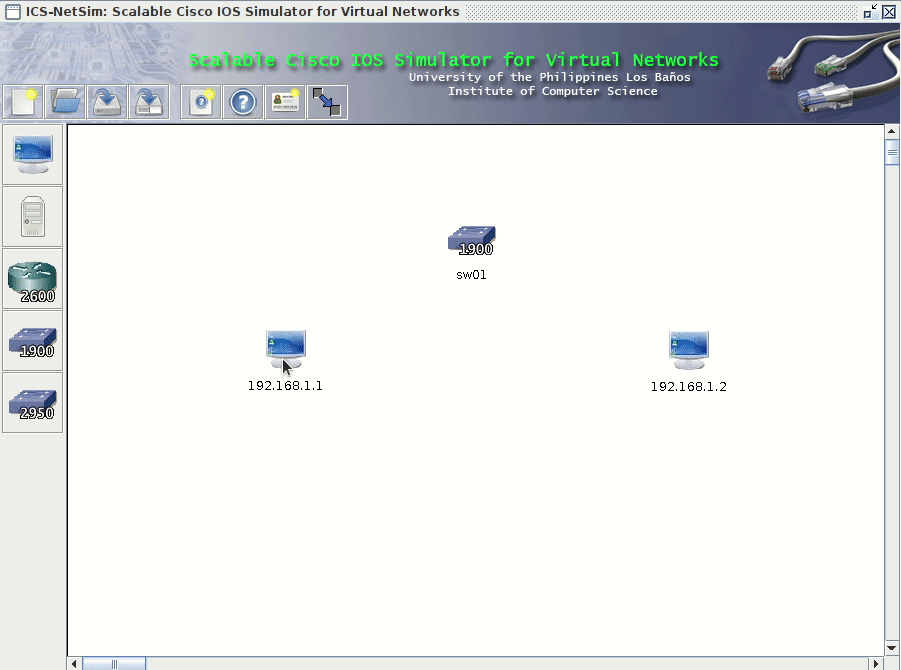

## About

ICS-NetSim is a simple network simulator inspired by Packet Tracer. It was originally developed by Michael Detras and Vincent Lee for their 
capstone project in 2006 (see AUTHORS). It is currently used to teach the IP Routing lab in CMSC 137 Data Communications and Networking.

## Usage

Download the latest jar file from the Releases section. Make sure that you have the 
installed the correct JDK version.

`java -jar <jarfile>`

## Build from Source

Install Apache Ant

`ant jar`

The runnable jar file is in `dist/`
